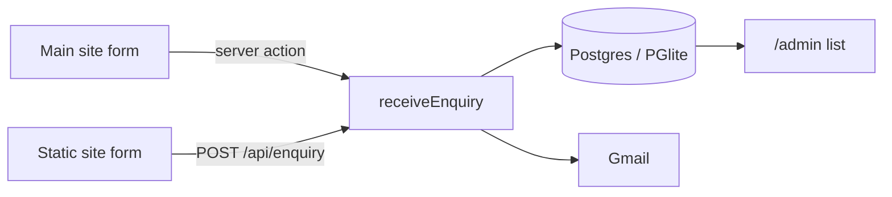

# Pragati Digital

Website for **Pragati Digital**, a web design studio building lead-generation websites for Nepali-owned businesses in Australia and for businesses across Nepal. *Pragati* (प्रगति) means progress.

The repository holds two versions of the site and the backend that receives enquiries from both:

| Folder | What it is |
| --- | --- |
| [`web/`](web/) | The main site, built with Next.js 16. Landing page, enquiry form, enquiry backend (email + database), password-protected admin list, offline support and an automated test suite. |
| [`static-site/`](static-site/) | A standalone single-file HTML version of the site with a different visual design. Its enquiry form posts to the Next.js backend. |
| [`TEST-CASES.md`](TEST-CASES.md) | The quality bar the site is tested against: message, trust, conversion, performance, accessibility, SEO, offline support and mobile. |

## Features

- **Landing page for two markets.** Australia (quotes in AUD) and Nepal (quotes in NPR, with eSewa, Khalti and Fonepay). A switch in the enquiry form changes the quoting details.
- **Live proof on the page.** Clocks for Sydney and Kathmandu, and the page's own load speed (LCP) and layout stability (CLS), measured in the visitor's browser.
- **Enquiries that don't get lost.** Every enquiry is saved to Postgres *and* emailed through Gmail. If one of those fails, the other still keeps it, and the visitor only sees an error if both fail.
- **Admin list** at `/admin`, behind a username and password, showing every enquiry with its email delivery status.
- **Public enquiry API** at `/api/enquiry` for forms hosted on other sites, with an allow-list of sites, rate limiting, a size cap and a spam trap.
- **Installable and offline-ready** (PWA): manifest, icons and a service worker that keeps the home page available offline.
- **Accessible and fast by default**: WCAG 2.2 AA checks, 48 px touch targets, reduced-motion support, light and dark themes, self-hosted fonts.

## Run it locally

You need **Node.js 20.9 or newer**.

```bash
cd web
npm install
npm run dev
```

Open <http://localhost:3000>. That's enough to browse the site and send test enquiries:

- With no database configured, enquiries are saved to a built-in Postgres (PGlite) in `web/.data/`.
- With no Gmail details, enquiries are still saved but not emailed. The server log says so.

To see the admin list, set a password first (next section), then open <http://localhost:3000/admin> and sign in as `admin`.

### Configuration

Copy the template and fill in what you need:

```bash
cd web
cp .env.example .env.local
```

`.env.local` is ignored by git, so passwords never get committed. Restart the server after changing it.

| Variable | Needed for | Notes |
| --- | --- | --- |
| `GMAIL_USER` | Emailing enquiries | The Gmail address the site sends from. |
| `GMAIL_APP_PASSWORD` | Emailing enquiries | A 16-character [app password](https://myaccount.google.com/apppasswords), not your normal Gmail password. Needs 2-Step Verification on the account. |
| `ENQUIRY_TO` | Optional | Where enquiries are delivered. Defaults to `GMAIL_USER`. |
| `DATABASE_URL` | Hosted database | A Postgres connection string (Neon, Supabase, …). Leave empty to use PGlite. The table is created automatically. |
| `PGLITE_DIR` | Optional | Where PGlite stores data when `DATABASE_URL` is empty. Default `.data/pglite`. |
| `ADMIN_PASSWORD` | `/admin` | Without it, the admin page stays closed. |
| `ADMIN_USER` | Optional | Admin username. Default `admin`. |
| `ENQUIRY_ALLOWED_ORIGINS` | Static site | Comma-separated site addresses allowed to post to `/api/enquiry` from a browser, e.g. `https://www.pragatidigital.com`. |
| `ENQUIRY_RATE_LIMIT` | Optional | Enquiries per visitor per 10 minutes on `/api/enquiry`. Default 5. |
| `ENQUIRY_DELIVERY` | Testing | Set to `log` to print enquiries instead of emailing them. |

### The static site

`static-site/` is plain HTML, CSS and JavaScript with no build step. Serve the folder with any static file server, for example:

```bash
npx serve static-site
```

Its form sends enquiries to the address in the form's `data-endpoint` attribute in `static-site/index.html`, currently `https://pragatidigital.com/api/enquiry`. To connect it to your own copy of the backend:

1. Point `data-endpoint` at your Next.js site's `/api/enquiry`.
2. Add the static site's address to `ENQUIRY_ALLOWED_ORIGINS` on the Next.js site.

The form only shows "Request received" when the backend confirms it saved or emailed the enquiry.

## How enquiries flow



Both forms end up in the same place (`web/src/lib/enquiries.ts`): save to the database, then send the email, then record whether the email went out.

## Testing

The Playwright suite in `web/tests/` covers every automated check in [`TEST-CASES.md`](TEST-CASES.md), plus the backend: the API, the database and the admin sign-in. It runs against a production build, never sends real email, and uses a throwaway database.

```bash
cd web
npm run test:e2e   # build, then run all tests
npm test           # run tests against the existing build
npm run lint
```

The tests drive **Microsoft Edge** (`channel: "msedge"` in `web/playwright.config.ts`), so no separate browser download is needed on Windows. On other systems, install Edge or run `npx playwright install chromium` and remove the `channel` line.

Two performance checks are known to be hard to meet:

- **PERF-03** (under 90 KB of HTML, CSS and JS): the Next.js and React runtime alone is larger. The test is marked as an expected failure.
- **PERF-01** (LCP within 2.0 s on a throttled mobile connection): it measures around 2.2 to 2.4 s on a quiet machine and slower on a busy one. Confirm it with Lighthouse or a real mid-range phone.

## Deploying

The Next.js site runs anywhere Node.js does. Set the environment variables from the table above on your host.

- **Serverless hosts (Vercel, Netlify and similar)**: set `DATABASE_URL` to a hosted Postgres database. PGlite writes to local disk, which these hosts don't keep between requests.
- **Your own server or container**: PGlite works as-is. Keep `web/.data/` on persistent storage and back it up.
- **Behind a proxy or CDN**: the API's rate limit identifies visitors by the `X-Forwarded-For` header, which hosting platforms set for you. On a server exposed directly to the internet, put a reverse proxy in front so that header can't be faked.

## Project structure

```text
.
├── README.md
├── TEST-CASES.md                  quality bar and test plan
├── static-site/                   standalone HTML version
│   ├── index.html
│   ├── sw.js                      offline support
│   ├── manifest.webmanifest
│   └── icons/
└── web/                           Next.js site
    ├── .env.example               configuration template
    ├── src/
    │   ├── app/
    │   │   ├── page.tsx           landing page
    │   │   ├── actions.ts         main-site form submission
    │   │   ├── api/enquiry/       public enquiry API
    │   │   ├── admin/             enquiries list
    │   │   └── globals.css        all styles and motion
    │   ├── components/            clocks, live vitals, ridge graph, form
    │   ├── lib/
    │   │   ├── site.ts            business details and page copy
    │   │   ├── enquiry.ts         validation for both forms
    │   │   ├── enquiries.ts       save, email and list enquiries
    │   │   ├── db.ts              Postgres / PGlite connection
    │   │   └── mailer.ts          Gmail delivery
    │   ├── proxy.ts               admin password protection
    │   └── instrumentation.ts     opens the database at startup
    ├── public/sw.js               offline support
    └── tests/pragati.spec.ts      Playwright suite
```

Page copy and business details (email address, domain, services, FAQ) live in `web/src/lib/site.ts`.
