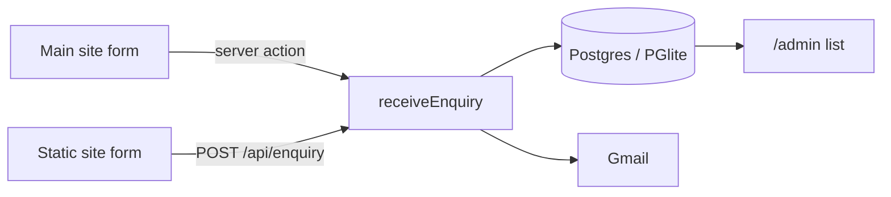

# Pragati Digital: developer guide

How to run, configure, test and deploy the Pragati Digital website. For what the website is and who it's for, see the [project README](../README.md).

This folder is the main site, built with Next.js 16: the landing page, the enquiry form, the enquiry backend (database + email) and a password-protected admin list. The standalone HTML version lives in [`../static-site/`](../static-site/).

## Run it locally

You need **Node.js 20.9 or newer**.

```bash
npm install
npm run dev
```

Open <http://localhost:3000>. That's enough to browse the site and send test enquiries:

- With no database configured, enquiries are saved to a built-in Postgres (PGlite) in `.data/`.
- With no Gmail details, enquiries are still saved but not emailed. The server log says so.

To see the admin list, set `ADMIN_PASSWORD` (below), then open <http://localhost:3000/admin> and sign in as `admin`.

## Commands

```bash
npm run dev        # development server on http://localhost:3000
npm run build      # production build
npm start          # serve the production build
npm run lint
npm run test:e2e   # build, then run the Playwright suite
npm test           # run the Playwright suite against the existing build
```

## Configuration

Copy the template and fill in what you need:

```bash
cp .env.example .env.local
```

`.env.local` is ignored by git, so passwords never get committed. Restart the server after changing it.

| Variable | Needed for | Notes |
| --- | --- | --- |
| `GMAIL_USER` | Emailing enquiries | The Gmail address the site sends from. |
| `GMAIL_APP_PASSWORD` | Emailing enquiries | A 16-character [app password](https://myaccount.google.com/apppasswords), not your normal Gmail password. Needs 2-Step Verification on the account. |
| `ENQUIRY_TO` | Optional | Where enquiries are delivered. Defaults to `GMAIL_USER`. |
| `DATABASE_URL` | Hosted database | A Postgres connection string (Neon, Supabase, …). Leave empty to use PGlite. The table is created automatically. |
| `PGLITE_DIR` | Optional | Where PGlite stores data when `DATABASE_URL` is empty. Default `.data/pglite`. |
| `ADMIN_PASSWORD` | `/admin` | Without it, the admin page stays closed. |
| `ADMIN_USER` | Optional | Admin username. Default `admin`. |
| `ENQUIRY_ALLOWED_ORIGINS` | Static site | Comma-separated site addresses allowed to post to `/api/enquiry` from a browser, e.g. `https://www.pragatidigital.com`. |
| `ENQUIRY_RATE_LIMIT` | Optional | Enquiries per visitor per 10 minutes on `/api/enquiry`. Default 5. |
| `ENQUIRY_DELIVERY` | Testing | Set to `log` to print enquiries instead of emailing them. |

Page copy and business details (email address, domain, services, FAQ) live in `src/lib/site.ts`.

## How enquiries flow



Both forms end up in `src/lib/enquiries.ts`: save to the database, then send the email, then record whether the email went out. An enquiry counts as received if either step worked, so the visitor only sees an error when both fail.

The public API at `/api/enquiry` accepts JSON or URL-encoded form data. It is protected by an allow-list of sites (`ENQUIRY_ALLOWED_ORIGINS`), a rate limit, a 20 KB size cap and a hidden spam-trap field.

### Connecting the static site

The static site's form sends to the address in its `data-endpoint` attribute (in `../static-site/index.html`), currently `https://pragatidigital.com/api/enquiry`. To connect it to your own copy:

1. Point `data-endpoint` at this site's `/api/enquiry`.
2. Add the static site's address to `ENQUIRY_ALLOWED_ORIGINS` here.

To preview the static site locally, run `npx serve ../static-site`.

## Testing

The Playwright suite in `tests/` covers every automated check in [`TEST-CASES.md`](../TEST-CASES.md), plus the backend: the API, the database and the admin sign-in. It runs against a production build, never sends real email and uses a throwaway database.

The tests drive **Microsoft Edge** (`channel: "msedge"` in `playwright.config.ts`), so no separate browser download is needed on Windows. On other systems, install Edge or run `npx playwright install chromium` and remove the `channel` line.

Two performance checks are known to be hard to meet:

- **PERF-03** (under 90 KB of HTML, CSS and JS): the Next.js and React runtime alone is larger. The test is marked as an expected failure.
- **PERF-01** (LCP within 2.0 s on a throttled mobile connection): it measures around 2.2 to 2.4 s on a quiet machine and slower on a busy one. Confirm it with Lighthouse or a real mid-range phone.

## Deploying

The site runs anywhere Node.js does. Set the environment variables from the table above on your host.

- **Serverless hosts (Vercel, Netlify and similar)**: set `DATABASE_URL` to a hosted Postgres database. PGlite writes to local disk, which these hosts don't keep between requests.
- **Your own server or container**: PGlite works as-is. Keep `.data/` on persistent storage and back it up.
- **Behind a proxy or CDN**: the API's rate limit identifies visitors by the `X-Forwarded-For` header, which hosting platforms set for you. On a server exposed directly to the internet, put a reverse proxy in front so that header can't be faked.

## Where things are

```text
web/
├── .env.example               configuration template
├── src/
│   ├── app/
│   │   ├── page.tsx           landing page
│   │   ├── actions.ts         main-site form submission
│   │   ├── api/enquiry/       public enquiry API
│   │   ├── admin/             enquiries list
│   │   └── globals.css        all styles and motion
│   ├── components/            clocks, live vitals, ridge graph, form
│   ├── lib/
│   │   ├── site.ts            business details and page copy
│   │   ├── enquiry.ts         validation for both forms
│   │   ├── enquiries.ts       save, email and list enquiries
│   │   ├── db.ts              Postgres / PGlite connection
│   │   └── mailer.ts          Gmail delivery
│   ├── proxy.ts               admin password protection
│   └── instrumentation.ts     opens the database at startup
├── public/sw.js               offline support
└── tests/pragati.spec.ts      Playwright suite
```

This project uses Next.js 16, whose APIs differ from older versions; for example, `middleware.ts` is now `proxy.ts`. The docs for this exact version ship in `node_modules/next/dist/docs/`.
