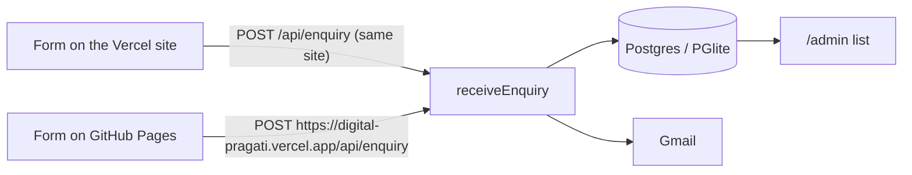

# Digital Pragati: developer guide

How to run, configure, test and deploy the Digital Pragati website. For what the website is and who it's for, see the [project README](../README.md).

## How it fits together

- **The website is [`../static-site/`](../static-site/)**: one plain HTML page with its styles and scripts inline, plus an offline service worker, a web app manifest and icons. It is the only copy of the design and copy. Edit it there.
- **This folder is a Next.js 16 app** deployed on Vercel. Before `npm run dev` and `npm run build`, [`scripts/sync-static-site.mjs`](scripts/sync-static-site.mjs) copies `../static-site/` into `public/`, and a rewrite in [`next.config.ts`](next.config.ts) serves `public/index.html` at `/`. The copies in `public/` are git-ignored and overwritten on every run, so edits made there are lost.
- **The app adds the backend**: the enquiry API at `/api/enquiry`, the database, Gmail delivery, and the password-protected enquiries list at `/admin`. It also serves `/offline`, the 404 page, `robots.txt`, `sitemap.xml` and app icons.
- **GitHub Pages** publishes `../static-site/` as-is (see `../.github/workflows/pages.yml`). Both hosts show the same page.

## Run it locally

You need **Node.js 20.9 or newer**.

```bash
npm install
npm run dev
```

Open <http://localhost:3000>. That's enough to browse the site and send test enquiries:

- With no database configured, enquiries are saved to a built-in Postgres (PGlite) in `.data/`.
- With no Gmail details, enquiries are still saved but not emailed. The server log says so.

After editing `../static-site/`, restart `npm run dev` (or run `npm run sync:static`) to copy the changes in.

To see the admin list, set `ADMIN_PASSWORD` (below), then open <http://localhost:3000/admin> and sign in as `admin`.

## Commands

```bash
npm run dev          # copy the static site, then start the dev server on http://localhost:3000
npm run build        # copy the static site, then build for production
npm start            # serve the production build
npm run sync:static  # copy ../static-site into public/ on its own
npm run lint
npm run test:e2e     # build, then run the Playwright suite
npm test             # run the Playwright suite against the existing build
```

## Configuration

Copy the template and fill in what you need:

```bash
cp .env.example .env.local
```

`.env.local` is ignored by git, so passwords never get committed. Restart the server after changing it. On Vercel, set these under Settings → Environment Variables and redeploy.

| Variable | Needed for | Notes |
| --- | --- | --- |
| `GMAIL_USER` | Emailing enquiries | The Gmail address the site sends from. |
| `GMAIL_APP_PASSWORD` | Emailing enquiries | A 16-character [app password](https://myaccount.google.com/apppasswords), not your normal Gmail password. Needs 2-Step Verification on the account. |
| `ENQUIRY_TO` | Optional | Where enquiries are delivered. Defaults to `GMAIL_USER`. |
| `DATABASE_URL` | Hosted database | A Postgres connection string (Neon, Supabase, …). Leave empty to use PGlite. The table is created automatically. On Vercel, the Neon integration sets it. |
| `PGLITE_DIR` | Optional | Where PGlite stores data when `DATABASE_URL` is empty. Default `.data/pglite`. |
| `ADMIN_PASSWORD` | `/admin` | Without it, the admin page stays closed. |
| `ADMIN_USER` | Optional | Admin username. Default `admin`. |
| `ENQUIRY_ALLOWED_ORIGINS` | GitHub Pages form | Comma-separated site addresses allowed to post to `/api/enquiry` from another site, e.g. `https://ali-sazzad.github.io`. Posts from the app's own site are always allowed. |
| `ENQUIRY_RATE_LIMIT` | Optional | Enquiries per visitor per 10 minutes on `/api/enquiry`. Default 5. |
| `ENQUIRY_DELIVERY` | Testing | Set to `log` to print enquiries instead of emailing them. |

Business details used by the backend (name, site address, email, market labels) live in `src/lib/site.ts`. The website's copy lives in `../static-site/index.html`.

## How enquiries flow



The form picks its destination by where the page is served:

- **On GitHub Pages** (a hostname ending in `github.io`) or opened as a local file, it posts to the absolute address in the form's `data-endpoint` attribute, `https://digital-pragati.vercel.app/api/enquiry`. That site must list the Pages address in `ENQUIRY_ALLOWED_ORIGINS`.
- **Anywhere else** (production, preview deployments, local `npm run dev` or `npm start`), the page is served by this app, so it posts to its own `/api/enquiry`.

Every enquiry ends up in `src/lib/enquiries.ts`: save to the database, then send the email, then record whether the email went out. An enquiry counts as received if either step worked, so the visitor only sees an error when both fail. The form shows success only after the API confirms it.

The API accepts JSON or URL-encoded form data. It is protected by an allow-list of other sites (`ENQUIRY_ALLOWED_ORIGINS`), a rate limit, a 20 KB size cap and a hidden spam-trap field.

The website's service worker (`../static-site/sw.js`) never intercepts or caches `/admin` or `/api/`, so the private enquiries list is never stored in a visitor's browser cache.

## Testing

The Playwright suite in `tests/` checks the home page against every automated case in [`TEST-CASES.md`](../TEST-CASES.md), plus the backend: the API, the database and the admin sign-in. It runs against a production build, never sends real email and uses a throwaway database.

The tests drive **Microsoft Edge** (`channel: "msedge"` in `playwright.config.ts`), so no separate browser download is needed on Windows. On other systems, install Edge or run `npx playwright install chromium` and remove the `channel` line.

Beyond `TEST-CASES.md`, the suite also checks that the service worker never caches `/admin` or `/api/` (SW-01) and that the home page is always revalidated (CACHE-01).

Known gaps:

- **MOB-03** (body text at least 16 px on mobile) is marked as an expected failure. Several small labels in the design are 12 to 15 px: section eyebrows, the concept cards' Flow/SEO labels, the studio-clocks note, the pledge table and footnote, form labels, the carousel counter and flow chips. Raise those sizes in `static-site/index.html` and remove the `test.fail()` to close it.
- **PERF-01** (LCP within 2.0 s on a throttled mobile connection) depends on the machine's CPU and swings between about 1.8 and 2.5 s from run to run. Confirm it with Lighthouse or a real mid-range phone.

## Deploying

The site is deployed on Vercel from GitHub: every push to `main` builds and deploys automatically (project root directory `web`). The build reads `../static-site/`, which works because the Vercel project includes source files outside the root directory; if that setting is ever turned off, the build fails with a clear message rather than deploying an empty home page.

- **Serverless hosts (Vercel, Netlify and similar)**: set `DATABASE_URL` to a hosted Postgres database. PGlite writes to local disk, which these hosts don't keep between requests.
- **Your own server or container**: PGlite works as-is. Keep `.data/` on persistent storage and back it up.
- **Behind a proxy or CDN**: the API's rate limit identifies visitors by the `X-Forwarded-For` header, which hosting platforms set for you. On a server exposed directly to the internet, put a reverse proxy in front so that header can't be faked.

## Where things are

```text
static-site/                   the website (the only copy; GitHub Pages publishes it as-is)
├── index.html
├── sw.js                      offline support; skips /admin and /api/
├── offline.html               shown offline for pages not saved on the device
├── manifest.webmanifest
└── icons/
web/
├── .env.example               configuration template
├── next.config.ts             serves public/index.html at /, cache headers
├── scripts/sync-static-site.mjs  copies ../static-site into public/
├── public/                    generated copy of ../static-site (git-ignored)
├── src/
│   ├── app/
│   │   ├── api/enquiry/       enquiry API
│   │   ├── admin/             enquiries list
│   │   ├── offline/           offline page for the app's own pages
│   │   ├── layout.tsx         layout for /admin, /offline and the 404 page
│   │   └── globals.css        styles for those pages
│   ├── lib/
│   │   ├── site.ts            business details used by the backend
│   │   ├── enquiry.ts         enquiry validation
│   │   ├── enquiries.ts       save, email and list enquiries
│   │   ├── db.ts              Postgres / PGlite connection
│   │   └── mailer.ts          Gmail delivery
│   ├── proxy.ts               admin password protection
│   └── instrumentation.ts     opens the database at startup
└── tests/pragati.spec.ts      Playwright suite
```

This project uses Next.js 16, whose APIs differ from older versions; for example, `middleware.ts` is now `proxy.ts`. The docs for this exact version ship in `node_modules/next/dist/docs/`.
